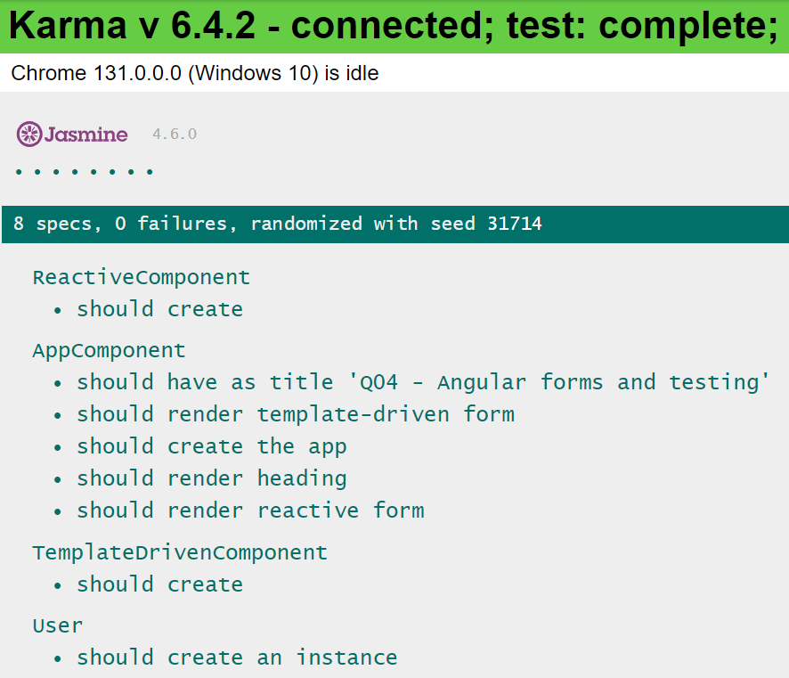
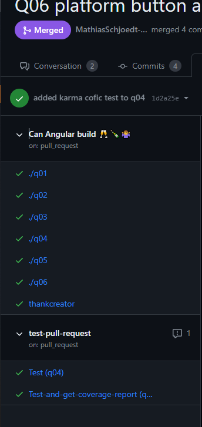
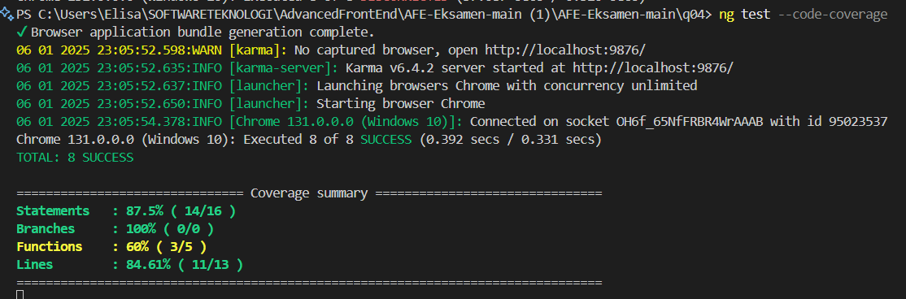

# Q4: Angular Forms og Testing

---

**Questions:**

- 1. Forklar template-driven forms i Angular.
- 2. Forklar reactive-driven forms i Angular.
- 3. Diskutér fordele og ulemper ved de forskellige tilgange.
- 4. Forklar, hvordan man tester Angular-applikationer.

**Run Command:**

For at starte applikationen:
```bash
ng serve -o
```

---

## 1. Handling Forms i Angular
At håndtere brugerinput er en af de vigtigste dele af en webapplikation. Angular tilbyder to måder at håndtere forms på: **template-driven forms** og **reactive forms**. 

- **Template-driven forms** er baseret på direktiver og bruges ofte til simple formularer.
- **Reactive forms** er mere robuste og skalerbare, hvilket gør dem velegnede til komplekse formularer.

Valget mellem de to afhænger af use-casen:
- Brug template-driven forms, hvis du kan håndtere al logikken direkte i HTML-skabelonen.
- Brug reactive forms, hvis du har brug for mere kontrol over formularlogikken.

---

## 1.1 Template-driven Forms

Template-driven forms oprettes med direktiver direkte i HTML-skabelonen. Formularvalidering og datahåndtering sker også i template, og data sendes til komponentklassen ved indsendelse OnSubmit.

### **Nøgleelementer:**
1. **NgForm**: Automatisk knyttet til `<form>`-elementet via `FormsModule`.
2. **NgModel**: Binder data mellem skabelonen og modellen.
3. **NgModelGroup**: Grupperer relaterede kontroller.

**Eksempel**:
- **Fil**: [`src/app/template-driven/template-driven.component.html`](./src/app/template-driven/template-driven.component.html)
- **Linje 13**: Formularreference:
  ```html
  <form #f="ngForm">
  ```
- **Fil**: [`src/app/app.module.ts`](./src/app/app.module.ts)
- **Linje 11**: Import af `FormsModule`:
  ```typescript
  import { FormsModule } from '@angular/forms';
  ```

Validering og datahåndtering udføres med `ngModel`:
- **Fil**: [`src/app/template-driven/template-driven.component.html`](./src/app/template-driven/template-driven.component.html)
- **Linje 25**: Databinding:
  ```html
  <input name="username" ngModel required>
  ```

Når brugeren klikker på "Submit", kaldes `onSubmit()`-metoden i komponentklassen:
- **Fil**: [`src/app/template-driven/template-driven.component.ts`](./src/app/template-driven/template-driven.component.ts)
- **Linje 12**:
  ```typescript
  onSubmit(form: NgForm) {
    console.log(form.value);
  }
  ```

---

## 2.Reactive Forms

Reactive forms bruger en **model-driven tilgang**, hvor formularens logik defineres i komponentklassen. 
De tilbyder synkron adgang til data, immutabilitet og tracking via observables.

### **Nøgleelementer:**
1. **FormControl**: Repræsenterer en individuel kontrol og dens status.
2. **FormGroup**: Grupperer flere kontroller.
3. **FormBuilder**: Forenkler oprettelsen af kontroller og grupper.

**Eksempel**:
- **Fil**: [`src/app/reactive/reactive.component.ts`](./src/app/reactive/reactive.component.ts)
- **Linje 10**: Brug af `FormBuilder`:
  ```typescript
  constructor(private fb: FormBuilder) {
    this.profileForm = this.fb.group({
      firstName: [''],
      lastName: [''],
      address: this.fb.group({
        street: [''],
        city: [''],
        state: [''],
        zip: ['']
      })
    });
  }
  ```

**Validering**:
Reactive forms giver mulighed for at bruge funktioner til validering:
- **Påkrævede felter**:
  ```typescript
  firstName: ['', Validators.required]
  ```

---

## 3. Key Differences mellem Form Typer

| Egenskab             | Template-driven Forms       | Reactive Forms         |
|----------------------|-----------------------------|------------------------|
| **Form Model**       | Implicit via direktiver     | Eksplicit i komponent  |
| **Data Model**       | Ustruktureret og mutabel    | Struktureret og immutabel |
| **Data Flow**        | Asynkron                   | Synkron                |
| **Validering**       | Direktiver                 | Funktioner             |

---

## 4. Testing Angular Apps


Angular tilbyder testværktøjer i `@angular/core/testing`. Det centrale værktøj er **TestBed**, som bruges til at konfigurere og teste Angular-komponenter og services.

### **Nøglefunktioner:**
1. **TestBed.configureTestingModule()**:
   - Konfigurerer et testmodul, der emulerer et @NgModule.
2. **TestBed.createComponent()**:
   - Opretter en instans af en komponent til test.

**Eksempel**:
- **Fil**: [`src/app/app.component.spec.ts`](./src/app/app.component.spec.ts)
  ```typescript
  it('should create the app', () => {
    const fixture = TestBed.createComponent(AppComponent);
    const app = fixture.componentInstance;
    expect(app).toBeTruthy();
  });
  ```

**Debugging**:
Komponenten kan testes gennem `ComponentFixture`, som giver adgang til DOM-elementet og ændringsdetektering.

---

## **CI-testing med Karma og Jasmine**

CI-tests kan køres ved hjælp af **Karma** (test runner) og **Jasmine** (test framework). Karma konfigureres i `karma.conf.js`.


På GitHub kan tests integreres i CI-processen, hvor resultaterne vises i pull requests.

**Eksempel**:
- **Test CI-output**: 
- **Coverage-rapport**: 


**GitHub Actions Workflow**:
- Se [workflow-filen](./../.github/workflows/TestAndPushResults.yml).

