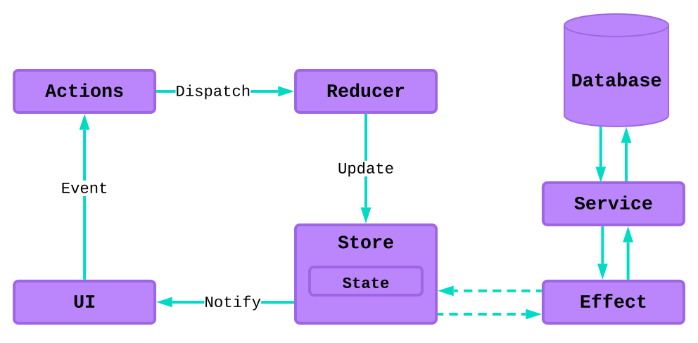

# Q05 Styling og tredjepartsbiblioteker

**Spørgsmål:**

- Forklar og diskuter responsivt webdesign (Flexbox, Grid og media queries)
- Forklar, hvordan tredjepartsbiblioteker kan bruges til at udvikle webapplikationer (eksempler: NgRx, Tailwind og Angular Material)

**Kommando til at starte applikationen:**
```bash
ng serve
```

---

## 1.Responsivt webdesign

Responsivt webdesign handler om at sikre, at webapplikationer fungerer og ser godt ud på både mobile enheder og desktop. Dette opnås gennem brugen af **Flexbox**, **Grid**, og **media queries**.

### [Flexbox](./src/styles.scss)

Flexbox er en CSS-layoutmodel, der bruges til at arrangere elementer dynamisk og fleksibelt i én dimension (enten horisontalt eller vertikalt). Flexbox gør det muligt at håndtere pladsfordeling og justering uden brug af komplekse CSS-regler.

**Nøgleegenskaber:**
- **`display: flex`**: Aktiverer flex-containeren.
- **`flex-wrap`**: Tillader elementer at bryde til en ny linje.
- **`justify-content`**: Justerer elementer langs hovedaksen (f.eks. `space-between` eller `center`).
- **`align-items`**: Justerer elementer langs krydsaksen (f.eks. `flex-start` eller `center`).

**Eksempel:**
```css
.container {
  display: flex;
  flex-wrap: wrap;
  justify-content: space-between;
}
```

---

### [Grid og Media Queries](./src/app/grid/grid.component.scss)

Grid er en kraftfuld layoutmodel, der håndterer både rækker og kolonner. Med **CSS Grid** kan du definere layoutet med rækker og kolonner og styre placeringen af elementer i gitteret.

**Nøgleegenskaber:**
- **`grid-template-columns`**: Definerer antallet af kolonner.
- **`grid-gap`**: Tilføjer mellemrum mellem rækker og kolonner.

**Eksempel:**
```css
.container {
  display: grid;
  grid-template-columns: 1fr 2fr;
  grid-gap: 20px;
}
```

**Media Queries** bruges sammen med Grid for at gøre layoutet responsivt. De muliggør ændringer af layoutet afhængigt af skærmstørrelsen.

**Eksempel med Media Queries:**
```css
@media (max-width: 768px) {
  .container {
    grid-template-columns: 1fr;
  }
}
```

---

## 2. Tredjepartsbiblioteker

Tredjepartsbiblioteker forenkler udviklingen ved at tilbyde færdige værktøjer og komponenter, som kan bruges direkte i Angular-projekter. Eksempler inkluderer **Tailwind**, **Angular Material** og **NgRx**.

---

### **[Tailwind CSS](./src/app/tailwind/tailwind.component.html)**

Tailwind er et utility-first CSS-framework, der gør det muligt at style direkte i HTML med klasser. Det er meget fleksibelt og understøtter avanceret tilpasning via en konfigurationsfil.

**Fordele:**
- Hurtig styling uden at skrive separat CSS.
- Meget tilpasselig og nem at integrere.
- Effektiv håndtering af responsivt design.

**Eksempel:**
```html
<button class="bg-blue-500 text-white font-bold py-2 px-4 rounded">
  Klik her
</button>
```

---

### **[Angular Material](./src/app/material/material.component.html)**

Angular Material er et UI-bibliotek baseret på Material Design. Det indeholder præ-stylet komponenter som knapper, dialogbokse og datatabeller.

**Fordele:**
- Hurtig implementering af komponenter.
- Understøttelse af temaer (f.eks. brugerdefinerede farvepaletter).
- Indbyggede responsivitetsegenskaber.

**Eksempel:**
```html
<mat-toolbar color="primary">
  Angular Material Toolbar
</mat-toolbar>
```

---

### **NgRx (State Management)**

NgRx er et tilstandsmanagementbibliotek, der bruges til at håndtere komplekse applikationstilstande i Angular-projekter. Det er baseret på Redux og understøtter sideeffekter som asynkrone API-kald.


#### Hvornår skal du bruge NgRx?
- Når mange komponenter deler data (Shared State).
- Når data skal gemmes og gendannes (Hydrated State).
- Når data skal være tilgængelige ved navigering (Available State).
- Når data kræver sideeffekter for at blive hentet (Retrieved State).

#### Komponenter i NgRx:

1. **Store**: Central kilde til applikationens tilstand.
2. **Actions**: Hændelser, der ændrer tilstanden.
3. **Reducers**: Pure functions, der definerer tilstandsovergange.
4. **Effects**: Håndterer sideeffekter som HTTP-anmodninger.

**Eksempel:**
```typescript
import { createAction, props } from '@ngrx/store';

export const addItem = createAction('[Cart] Add Item', props<{ item: string }>());
```

---

### Konklusion

Responsivt design opnås gennem teknologier som **Flexbox**, **Grid**, og **Media Queries**, mens tredjepartsbiblioteker som **Tailwind**, **Angular Material** og **NgRx** gør udviklingen hurtigere og mere effektiv. Brug disse værktøjer til at skabe moderne, skalerbare og brugervenlige webapplikationer.

