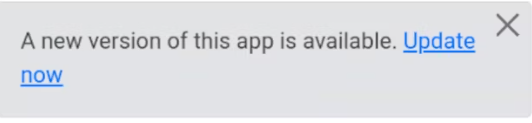

# Q06 Progressive Web Apps

<!-- Referencer til kode vil blive lavet i markdown ved at bruge: Se mere i linje XX i [navn på snippet]("PATH_TO_FILE") -->

**Spørgsmål:**

- 1. Forklar konceptet bag PWA
- 2. Vis hvordan man implementerer en PWA med Angular

**ng serve**

## 1 Hvad er en PWA

- **Progressiv** - Fungerer for alle brugere, uanset valg af browser, da den er bygget med progressiv forbedring som grundprincip.

- **Responsiv** - Tilpasser sig enhver formfaktor: desktop, mobil, tablet eller fremtidige enheder. Se mere om responsivt design på: [q05](https://codebloodedmama.github.io/AFE-Eksamen/q05/).

- **Forbindelsesuafhængig** - Forbedret med service workers, så den virker offline eller på dårlige netværk. Se [lagring](#lagring) for offline brug.

- **App-lignende** - Føles som en app for brugeren med app-stil interaktioner og navigation, fordi den er bygget på app shell-modellen.

- **Opdateret** - Altid opdateret takket være service worker-opdateringsprocessen.

- **Sikker** - Leveres via HTTPS for at forhindre aflytning og sikre, at indholdet ikke er blevet manipuleret.

- **Opdagelig** - Identificerbar som en "applikation" takket være W3C-manifest og service worker-registreringsomfang, hvilket gør det muligt for søgemaskiner at finde den.

- **Genaktiverbar** - Gør det nemt at genaktivere via funktioner som push-notifikationer.

- **Installerbar** - Giver brugere mulighed for at "beholde" de apps, de finder mest nyttige, på deres startskærm uden at skulle bruge en appbutik.

- **Linkbar** - Nem at dele via URL uden behov for kompleks installation.

## Lagring

For at bruge en app i offline-tilstand er det nyttigt at gemme data i en offline-lagring, som f.eks. en lokal (storage) database.

Et eksempel er givet, hvor vi viser gemte data, hvis der er nogen, indtil vi indlæser dataene.

Du kan se, hvordan dette bruges i linje 5 af [cards List template](./src/app/credit-card/credit-card-list/credit-card-list.component.html). Her hentes data, sætter loading-tilstanden, og viser de gemte værdier.

For at forstå, hvordan gemmes og hentes data, henvises til [cards List TS](./src/app/credit-card/credit-card-list/credit-card-list.component.ts)-filen.

## 2 Implementering af PWA
<!-- Se https://hackernoon.com/building-progressive-web-application-pwa-with-angular -->

Vi har inkluderet installation og online status i bunden (footer): 

### Gør den installerbar

Kør `ng add @angular/pwd` for at tilføje biblioteket og konfigurere Angular service worker. Dette opdaterer følgende filer:

- package.json: Biblioteket `@angular/service-worker` blev tilføjet i [linje 25](./package.json).
- src/app/app.module.ts: Konfiguration af service worker blev tilføjet. Se linje 33-39 for [Service worker registrering](./src/app/app.module.ts).
- src/index.html: Manifestfil-konfiguration og tema farve blev tilføjet [linje 18](./src/index.html).

### Tjek online status

En vigtig ting er at sikre "frisk" data. Dette gøres ved at bruge `window.navigator.online`, som ses i linje 45-48 af [koden](./src/app/footer/footer.component.ts).

Jeg tilføjer også en event listener til at detektere ændringer, som vist i [linje 25](./src/app/footer/footer.component.ts).

### Opdater App

Når appen er "downloadet", skal en opdateringsnotifikation implementeres.
Dette kan ses i [linje 28-50](./src/app/footer/footer.component.ts). Her bruges Angulars Service Worker Update til at opdatere appens version.

Vi laver derefter en popup-dialog, som ses her:

Implementeringen af dialogen kan ses i [template linje 42-49](./src/app/footer/footer.component.html).

### Forskellige Enheder - cross platform and devices

Ved opbygning af en progressiv web app er der nogle ting, der ikke automatisk fungerer for alle typer enheder, f.eks. hvordan man downloader fra en Android/Chromium-enhed versus en Apple-enhed.

Når vi indlæser opdateringsmodulet, tjekker vi platformtypen i funktionen `loadModalPwa()`.

Dette gøres også i templaten, hvor vi ser på feltet `modalPwaPlatform` for at differentiere mellem forskellige "divs".

Se [template linje 52-70](./src/app/footer/footer.component.html).

### Yderligere information om Service Workers

En service worker er en web worker, der implementerer en programmerbar netværksproxy, der kan reagere på web-/HTTP-anmodninger fra hoveddokumentet. Den kan tjekke tilgængeligheden af en fjernserver, cache indhold og levere dette indhold senere.

Service workers går gennem en tre-trins livscyklus:
- Registrering
- Installation
- Aktivering

- **Registrering:** Informerer browseren om service workerens placering for at forberede installationen.
- **Installation:** Finder sted, når der ikke er en service worker installeret, eller hvis der er en opdatering.
- **Aktivering:** Finder sted, når alle PWA'ens sider er lukket, så der ikke er konflikter mellem tidligere og opdaterede versioner.

Service workers bruges til:
- Håndtering af push-notifikationer
- Synkronisering af data i baggrunden
- Cachelagring eller hentning af ressourceanmodninger
- Aflæse netværksanmodninger

For at se en service worker i aktion: 
Åbn browserens inspector -> Gå til Application -> Vælg Service Workers.
