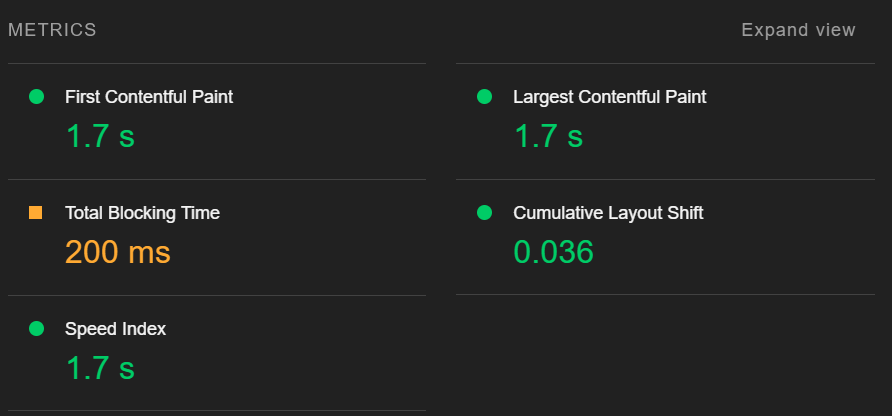

# Q08 SEO

<!-- Referencer til kode vil blive lavet i markdown ved at bruge: Se mere i linje XX i [navn på snippet]("PATH_TO_FILE") -->

**Spørgsmål:**

1. Forklar hvad Search Engine Optimization (SEO) er. Hvorfor og hvornår er det vigtigt?
2. Hvad påvirker SEO-rangering?
3. Hvad er Core Web Vitals? Og hvorfor er de vigtige?
4. Giv et overblik over Next.js og forklar hvordan man forbedrer SEO i en Next.js-webapp.

## 1. Hvad er Search Engine Optimization (SEO)?

SEO er en strategi for at sikre, at din hjemmeside rangerer højere i søgemaskiner som Google. Det handler om at øge synligheden og trafikken til din hjemmeside.

### Ranking

Placeringen af din hjemmeside sammenlignet med dine konkurrenter. Jo højere din hjemmeside rangerer i søgninger, desto flere besøgende vil du få.

### Trafik

SEO-måling fokuserer på trafikken: Hvor mange besøgende får din hjemmeside, og hvilke søgetermer leder dem dertil? Ikke al trafik er dog god trafik – du vil have besøgende, der er interesserede i dit produkt eller din service. Relevante søgetermer og indhold er afgørende.

## 2. Hvad påvirker SEO-rangering?

### Sitemap  

Et sitemap hjælper søgemaskinernes webcrawlere med at finde og indeksere alle sider på dit website. Et sitemap indeholder URL'er samt information som sidernes seneste opdateringsdato og prioritet. For eksempel har jeg oprettet et sidemap til mine GitHub-sider og de kan ses her:  [sitemap](./../sitemap.xml) 

Et sitemap kan bruges i Google Search Console til at sikre, at Google hurtigt kan finde alle dine sider.

Et sitemap kan bruges i Google Search Console til at sikre, at Google hurtigt kan finde alle dine sider.


### Metaheader

I headeren på en HTML-side kan du inkludere metadata som: [q03 index](./../q03/src/index.html)
The meta data tag have 4 properties: description, keywords, author, and viewport.  

```html
<meta name="description" content="This is the description of my website">
<meta name="keywords" content="keyword1, keyword2, keyword3, keyword4, etc.">

<meta name="author" content="CodeBloodedMama">

<meta name="viewport" content="width=device-width, initial-scale=1.0">
```

- **Description** bruges af søgemaskiner til at beskrive din hjemmeside i søgeresultater.
- **Keywords** hjælper søgemaskiner med at kategorisere indholdet.


read more here:
[HTML < meta > tag](https://www.w3schools.com/tags/tag_meta.asp)

### Content

Relevant og kvalitets content er afgørende for SEO. Søgemaskiner prioriterer sider, hvor brugerne bliver på siden længe og interagerer med indholdet. Hvis brugere hurtigt forlader en side, kan det skade rangeringen.

### Links

Links hjælper søgemaskiner med at forstå kategorien og relevansen af din hjemmeside.

- **Interne links:** Forbinder sider på din egen hjemmeside og forbedrer brugervenligheden.
- **Eksterne links:** Links til og fra andre hjemmesider. Kvaliteten og relevansen af disse links har stor betydning.

( affiliatelink til cloaking SEO)

### Ydeevne

God ydeevne er essentiel for SEO. Det inkluderer hurtig indlæsningstid, interaktivitet og visuel stabilitet. Disse faktorer måles med Core Web Vitals.

## 3. Core Web Vitals

Core Web Vitals er tre vigtige målepunkter, der vurderer brugeroplevelsen:

- **Loading Performance (LCP):** Tid det tager at indlæse(loade) det største element.
- **Interaktivitet (FID):** Tid det tager, før siden reagerer på brugerens første handling.
- **Visuel Stabilitet (CLS):** Hvor stabil siden er under indlæsning.

Disse målepunkter er vigtige for at sikre en god brugeroplevelse og forbedre SEO.


inspect -> Lighthouse -> Analyze page load

### Loading LCP

how long does it take to load the page. Here we look at the Largest Contentful Paint (LCP) .
This is the time it takes to load the largest element on the page.

### Interactivity FID

Hvor lang tid tager det for siden at blive interaktiv? 
Her ser vi på First Input Delay (FID). Dette er den tid, det tager for siden at blive interaktiv, hvilket betyder den tid, det tager for siden at reagere på den første brugerinteraktion, såsom et klik eller en scroll.
### Visual stability

Hvor stabil er siden? Her ser vi på Cumulative Layout Shift (CLS). Dette er mængden af uventet layoutskift af visuelt sideindhold. Dette sker, når siden flytter sig rundt, for eksempel når du er ved at klikke på en knap, og så dukker en annonce op, og du klikker på annoncen i stedet.

Når CSS anvendes sent, for eksempel, vil siden først blive indlæst, og derefter vil CSS blive anvendt. Dette vil få siden til at hoppe rundt. Dette er ikke godt for brugeroplevelsen.


## 4. Next.js og SEO 
Next.js er et open-source webudviklingsframework til React. Det understøtter server-side rendering (SSR) og statisk generering, som er fordelagtige for SEO.


### Static generation

Next.js genererer HTML under build-processen, hvilket sikrer, at siderne er optimeret og klar til at blive indekseret af søgemaskiner.
Static generaation er default rendering metode i next. Pages som ikke skal fetce externe api'er, vil automatisk blive genereret som statiske under build time. Dette **generere HTML for hver side i build time**. Dette HTML er så genbrugt ved hver request, hvilket optimerer loading tiden fordi html allerede er genereret og klar til servering. Dette er også den mest optimale måde for SEO da den så er klar til at blive indexeret af webcrawlers.

#### Server-Side Rendering

Med SSR renderes siderne på serveren, får søgemaskiner adgang til det fulde indhold fra starten. Dette forbedrer SEO sammenlignet med client-side rendering, hvor indholdet renderes i brugerens browser.
[getStaticProps](../q07/nextjs-blog/pages/posts/[id].js) 
kan blive brugt til at fetche extern data ved build time og sender det til page som en props. Dette kan bruges for sider som skal hente extern data men ikke skal hente det ved en user request time. Hvis data skal opdateret så er dette ikke en mulighed.
Dog giver dette en langsommere load time og en langsommere TimeToFirstByte ( TTFB).


#### Client-side rendering

Client-side rendering **genererer HTML på klienten**. Dette giver hurtig TTBF og hurtig første indlæsningstid. Dog er dette ikke godt for SEO, fordi indholdet ikke er renderet, når siden indlæses. Dette betyder, at crawlers vil have svært ved at læse siden.

#### Forbedring af Ydeevne

- **Kompilering og Minificering:** Reducerer størrelsen af koden.
- **Bundling:** Kombinerer filer for at minimere antallet af forespørgsler.

Ved at bruge Next.js kan man levere hurtige, optimerede sider, der understøtter god SEO.


