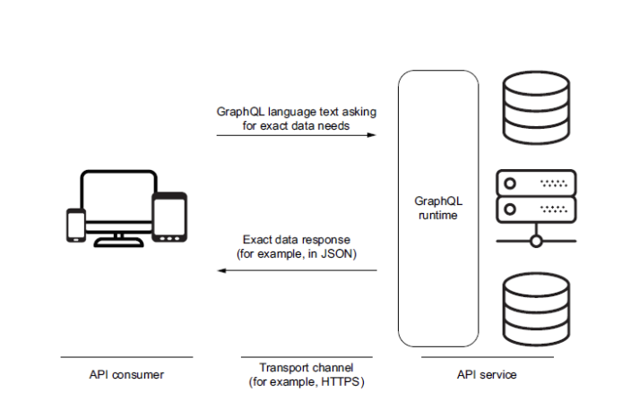
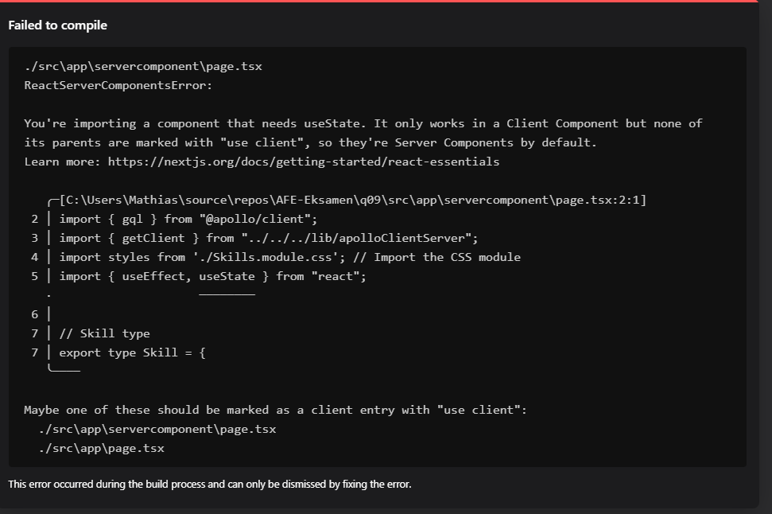

# Q09 GraphQL
<!-- Referencer til kode vil blive lavet i markdown ved at bruge: Se mere i linje XX i [navn på snippet]("PATH_TO_FILE") -->

**Spørgsmål:**

1. Forklar principperne for GraphQL.
2. Diskuter fordele og ulemper ved REST vs GraphQL.
3. Vis hvordan man tilgår et GraphQL Web API fra React.
4. Vis hvordan man tilgår et GraphQL Web API fra Next.js, og forklar hvorfor det er anderledes end at gøre det samme i React.

## 1. Hvad er GraphQL

GraphQL er et forespørgselssprog designet til at gøre kommunikationen mellem klienter og servere mere effektiv og fleksibel. Udviklet af Facebook i 2012, det tillader klienter at anmode om præcis de data, de har brug for, intet mere og intet mindre.

### grundprincipper i grapQL

- Effektiv datahentning: det eliminerer både overfetching og underfetching af data. Dette betyder, at en mobil app kan begrænse mængden af data, der overføres over netværket, hvilket er kritisk for ydeevnen, især på langsomme netværksforbindelser
- Single endpoint: I modsætning til REST, som bruger multiple endpoints, håndterer GraphQL alle forespørgsler gennem et enkelt endpoint. Dette simplificerer logistikken betydeligt for API-management
- stærk type definition: GraphQL bruger et skema, der definerer, hvordan dataene skal se ud. Dette skema er både en vejledning for udviklere og en kontrakt mellem serveren og klienten, som sikrer, at dataene er præcise og konsistente.
- introspection: tillader graphQL API'er at blive selvbeskrivende. Klienter kan forespørge et GraphQL API om, hvilke operationer det understøtter, hvilket er en stor fordel for udviklerværktøjer og automatiseret dokumentation.

## 2. fordele og ulemper ved REST vs GraphQL

### fordele
Fleksible forespørgsler tillader at man kan hente specifikke resoujrcer i en enkelt forespørgsel, hvilket er minder sandsynligt i REST.
- Bedre performance: For applikationer, der kræver at hente store mængder af sammenkoblede data, kan GraphQL gøre dette meget mere effektivt end REST.
- minder behov for versions: Da nye felter kan tilføjes som nye typer og eksisterende typer kan udvides uden at påvirke eksisterende forespørgsler, er der mindre behov for at versionere API'et
### ulemper ved GraphQL sammenlignet med REST
- kompleksitet i Query: komplekse forespørgsler kan overbelaste serveren, da de kræver dyb sam,menkobling mellem data og mange resourcer i en enkelt forespørgsel. 
- Caching udfordringer i graphql er mere komplekse pga strukturen i forespørgsler. REST er caching simpelt med en HTTP caching mekanisme.
- kompleks at integrere sammenlignet med rest pga datatyper og query strukturer.


At bygge et GraphQL API kan være mere intensivt end at bygge et REST API. Hvis et problem kan løses med et REST API, bør dette bruges. 
GraphQL er et godt valg, hvis du har mange forskellige datakilder, eller hvis du har mange forskellige klienter, der har brug for forskellige data. Valget mellem GraphQL og REST afhænger af specifikke projektbehov og ressource



Din GraphQL-server bruger et schema til at beskrive formen af din datagraf. Schemaet specificerer præcis hvilke forespørgsler og mutationer, der er tilgængelige for klienter at udføre mod din datagraf. 
Schemaet er lavet med GraphQL Schema Definition Language (SDL). Schemaet fungerer som en kontrakt mellem klienten og serveren. Klienten kan kun bede om det, der er defineret i schemaet.

Eksempel på et schema:

```javascript  
type Character {
    id: ID!
    name: String!
    appearsIn: [Episode!]!
    friends: [Character]
}

type Droid {
    id: ID!
    name: String!
}

enum Episode {
    NEWHOPE
    EMPIRE
    JEDI
}

type Query {
    hero(episode: Episode): Character
    droid(id: ID!): Droid
}
```

Strukturen af en GraphQL-query er tredelt. Den indeholder tre felter: 
- Dokument, 
- Variabler og 
- Meta-Information. 

Der er tre forskellige typer operationer:
- Query (simpel læsning), 
- Mutation (skrivning efterfulgt af en læsning) og 
- Subscription (anmodning om realtidsdataopdateringer).

Et eksempel på en GraphQL-forespørgsel og svar kan ses i følgende snippets:

```javascript
// Query
{
    hero(episode: NEWHOPE) {
        name
        friends {
            name
        }
    }
}

```

I denne forespørgsel beder vi om navnet på helten og navnene på heltens venner. Svaret vil se sådan ud:

```javascript
// Response
    {
        "data": {
            "hero": {
                "name": "R2-D2",
                "friends": [
                    {
                        "name": "Luke Skywalker"
                    },
                    {
                        "name": "Han Solo"
                    },
                    {
                        "name": "Leia Organa"
                    }
                ]
            }
        }
    }
```

Medmindre der opstår en fejl med anmodningen. Så vil svaret se sådan ud:

```javascript
// Response
    {
        "errors": [
            {
                "message": "Name for character with ID 1002 could not be fetched.",
                "locations": [
                    {
                        "line": 6,
                        "column": 7
                    }
                ],
                "path": [
                    "hero",
                    "friends",
                    1,
                    "name"
                ]
            }
        ]
    }
```

Med GraphQL får vi kun præcis det, vi beder om og intet mere. Dette betyder, at vi kan undgå overfetching og underfetching og ikke behøver at lave flere anmodninger for at få de data, vi har brug for, eller begynde at filtrere dataene på klientsiden.

## GraphQL in Next.js 'npm run dev'

### Apollo Client
Apollo Client er et omfattende state management bibliotek for JavaScript, der gør det muligt at administrere både lokale og eksterne data med GraphQL. 
Denne bruges til at hente, cache og ændre applikationsdata, alt imens UI automatisk opdateres.

#### Client component [Client component](./AppRouterNextGraphQL/src/app/clientcomponent/page.tsx)

Når man bruger en apollo client for en client komponent i NEXT.js skal man gøre følgende for opsætning:


1. Byg en ny apollo client i [lib folder](./AppRouterNextGraphQL/lib/apollo-wrapper.tsx)
2. Brug den wrapper fra trin1 og wrap RootLayout i [layout.tsx file](./AppRouterNextGraphQL/src/app/layout.tsx)
3. Byg en client komponent og brug apollo client i den i  [Client component](./AppRouterNextGraphQL/src/app/clientcomponent/page.tsx)
Trin 3 bruger apollo clienten ved at bruge  `UseSuspenseQuery` hook.

Der bliver også importet og brug  `gql` tag til at parse query string i et query document. Se linje 8 i  [Client component](./AppRouterNextGraphQL/src/app/clientcomponent/page.tsx)

Client component er instantiatet på line 9 i [Home component](./AppRouterNextGraphQL/src/app/page.tsx)
Client komponenten får et navn og starter en counter der er incrementet hvert sekund.

#### Server component [server component](./AppRouterNextGraphQL/src/app/servercomponent/page.tsx)
Man kan bruge apolloclienten i en server komponent, denne bruges til at udfører GraphQL forefspørgsler. 
Apollo clienten i server komponenten bruger asynkron datahentning, getData funktionen venter på forespørgslen fuldføres før den returerer data.
Rendering af data sker i server komponenten.

Ved at sætte cache-indstillingen til `no-store` angiver Next.js, at de hentede data aldrig skal caches.
 Implementering af  getServerSideProps-adfærden i app-mappen. Som dokumenteret på [Next.js website](https://nextjs.org/docs/app/building-your-application/upgrading/app-router-migration#step-6-migrating-data-fetching-methods)

se serverkomponenten her : [server component](./AppRouterNextGraphQL/src/app/servercomponent/page.tsx)

Apollo client vi bruger i  server component (line 40 & 47) kommer fra: [server component setup](./AppRouterNextGraphQL/lib/apolloClientServer.js) og denne instansitere en ny apollo client. 


Server component får et navn (barbarian) og en skill.

Vi kan specificere `"server only"` og forhindre klientkomponenter i at blive brugt, men dette er ikke nødvendigt.

`cache: 'no-store'` option allows us to see the suspense fallback that is used in the `Home` component. See more in line 10 in [home component](./AppRouterNextGraphQL/src/app/page.tsx)

### Trying to use Client components in Server Only



## GraphQL in React

GraphQL differs in React compared to Next.js in the sense that you don't have a server component. You only have client components.

The approach is still the same. We create a new apollo client and use the provider as a wrapper for the app. See more in line 21 in [index.js](./reactgraphql/src/index.js)

Then we create some client components that use the apollo client. See more in [line 16 & 18](./reactgraphql/src/App.js).

The functionality of the React app is quite simple. It has a dropdown menu that gets all the different classes in Dungeons and Dragons. When you select a class it will show the spells that the class can use. The dropdown menu can be seen in lines 16-22 in [App.js](./reactgraphql/src/components/Classes.js)

Then the selected class is used in the [Spells component](./reactgraphql/src/components/Spells.js).

The queries are still structured the same way as they were in Next.js.


```javascript  
type Character {
    id: ID!
    name: String!
    appearsIn: [Episode!]!
    friends: [Character]
}

type Droid {
    id: ID!
    name: String!
}

enum Episode {
    NEWHOPE
    EMPIRE
    JEDI
}

type Query {
    hero(episode: Episode): Character
    droid(id: ID!): Droid
}
```


Opdateret README.md
Strukturen af en GraphQL-forespørgsel er tredelt. Den indeholder tre felter: Dokument, Variabler og Meta-Information. Der er tre forskellige typer operationer: Query (simpel læsning), Mutation (skrivning efterfulgt af en læsning) og Subscription (anmodning om realtidsdataopdateringer).

Et eksempel på en GraphQL-forespørgsel og svar kan ses i følgende snippets:

```javascript
// Query
{
    hero(episode: NEWHOPE) {
        name
        friends {
            name
        }
    }
}

```
I denne forespørgsel beder vi om navnet på helten og navnene på heltens venner. Svaret vil se sådan ud:


```javascript
// Response
    {
        "data": {
            "hero": {
                "name": "R2-D2",
                "friends": [
                    {
                        "name": "Luke Skywalker"
                    },
                    {
                        "name": "Han Solo"
                    },
                    {
                        "name": "Leia Organa"
                    }
                ]
            }
        }
    }
```

Medmindre der opstår en fejl med anmodningen. Så vil svaret se sådan ud:


```javascript
// Response
    {
        "errors": [
            {
                "message": "Name for character with ID 1002 could not be fetched.",
                "locations": [
                    {
                        "line": 6,
                        "column": 7
                    }
                ],
                "path": [
                    "hero",
                    "friends",
                    1,
                    "name"
                ]
            }
        ]
    }
```

Med GraphQL får vi kun præcis det, vi beder om og intet mere. Dette betyder, at vi kan undgå overfetching og underfetching og ikke behøver at lave flere anmodninger for at få de data, vi har brug for, eller begynde at filtrere dataene på klientsiden.

## GraphQL i Next.js

### Apollo Client

Apollo Client er et omfattende state management bibliotek for JavaScript, der gør det muligt at administrere både lokale og eksterne data med GraphQL. Brug det til at hente, cache og ændre applikationsdata, alt imens din UI automatisk opdateres

#### Client component
Når du bruger Apollo Client til en klientkomponent i Next.js, skal du gøre følgende opsætning:


1. Create a new apollo client in the [lib folder](./AppRouterNextGraphQL/lib/apollo-wrapper.tsx)
2. Use the wrapper from step 1 and wrap the RootLayout in the [layout.tsx file](./AppRouterNextGraphQL/src/app/layout.tsx)
3. Create a client component and use the apollo client in the [Client component](./AppRouterNextGraphQL/src/app/clientcomponent/page.tsx)

Trin 3 bruger Apollo Client ved at bruge `UseSuspenseQuery` hook.

Vi kan også importe og bruge `gql` tag til at parse query string i et query document. Det gøres i client component på linje 8 i : [Client component](./AppRouterNextGraphQL/src/app/clientcomponent/page.tsx)


Client component er instansieret på line 9 in the [Home component](./AppRouterNextGraphQL/src/app/page.tsx)

Client component får kun et navn og starter en counter som incrfementere hvert sekund.

#### Server component

En anden måde at bruge Apollo Client på er ved at bruge en serverkomponent.

Normalt ville vi bruge getServerSideProps til at aktivere SSR, men dette er kun muligt i pages mappen. Siden den nyeste version af Next.js (13.5) bruger app mappen, er der sket nogle ændringer.

I pages mappen bruges getServerSideProps til at hente data på serveren og videresende props til den standardeksporterede React-komponent i filen. Den initiale HTML for siden er prerenderet fra serveren, efterfulgt af "hydrering" af siden i browseren (gør den interaktiv).

```typescript
// `pages` directory
 
export async function getServerSideProps() {
  const res = await fetch(`https://...`)
  const projects = await res.json()
 
  return { props: { projects } }
}
 
export default function Dashboard({ projects }) {
  return (
    <ul>
      {projects.map((project) => (
        <li key={project.id}>{project.name}</li>
      ))}
    </ul>
  )
}
```

Men vi kan desværre ikke bruge det længere, da vi bruger app mappen.

I stedet kan vi placere vores datahentning inde i vores React-komponenter. Dette giver os mulighed for at sende mindre JavaScript til klienten, mens vi bevarer den renderede HTML fra serveren.

Ved at sætte cache-indstillingen til no-store, angiver Next.js, at de hentede data aldrig skal caches. Dette er, hvordan vi implementerer getServerSideProps adfærd i app mappen. Som dokumenteret på [Next.js hjemmeside](https://nextjs.org/docs/app/building-your-application/upgrading/app-router-migration#step-6-migrating-data-fetching-methods).

```typescript
// `app` directory

// This function can be named anything
async function getProjects() {
  const res = await fetch(`https://...`, { cache: 'no-store' })
  const projects = await res.json()
 
  return projects
}
 
export default async function Dashboard() {
  const projects = await getProjects()
 
  return (
    <ul>
      {projects.map((project) => (
        <li key={project.id}>{project.name}</li>
      ))}
    </ul>
  )
}
```

Der er et lille problem med denne tilgang. Vi bruger Apollo, og Apollo Client bruger query metoden. Men vi kan sætte fetch-indstillingerne på Apollo query metoden og sætte cachen til no-store for stadig at få den samme adfærd

See more in line 43 & 50 in [server component](./AppRouterNextGraphQL/src/app/servercomponent/page.tsx)

Apollo client component com vi bruger i  server component (line 40 & 47) kommer fra:

[server component setup](./AppRouterNextGraphQL/lib/apolloClientServer.js)

som opretter en ny apollo client. 
Serverkomponenten får et navn (barbarian) og færdigheder.

Vi kan specificere "server only" og forhindre klientkomponenter i at blive brugt, men dette er ikke nødvendigt.


 `cache: 'no-store'` tillader os at se suspense fallback som bruges i home komponenten. Se mere på  line 10 in [home component](./AppRouterNextGraphQL/src/app/page.tsx)

### Forsøg på at bruge klientkomponenter i Server Only


## GraphQL i React

GraphQL adskiller sig i React sammenlignet med Next.js, da du ikke har en serverkomponent. Du har kun klientkomponenter.

Tilgangen er stadig den samme. Vi opretter en ny Apollo Client og bruger provider som en wrapper til appen. Se mere i linje 21 i[index.js](./reactgraphql/src/index.js)

Derefter opretter vi nogle klientkomponenter, der bruger Apollo Client. Se mere i linje [line 16 & 18](./reactgraphql/src/App.js).

Funktionaliteten af React appen er ret simpel. Den har en dropdown-menu, der får alle de forskellige klasser i Dungeons and Dragons. Når du vælger en klasse, vil den vise de spells, som klassen kan bruge. Dropdown-menuen kan ses i linje 16-22 in [App.js](./reactgraphql/src/components/Classes.js)

Derefter bruges den valgte klasse i Spells component.[Spells component](./reactgraphql/src/components/Spells.js).

Forespørgslerne er stadig struktureret på samme måde som de var i Next.js.
__________________

Trin 1: Forklar principperne for GraphQL
Introduktion til GraphQL:

Forklar, hvad GraphQL er, og hvordan det adskiller sig fra REST.
Beskriv de grundlæggende komponenter i GraphQL: Queries, Mutations og Subscriptions.
Vis et eksempel på en GraphQL-forespørgsel og svar.
GraphQL Schema:

Forklar, hvordan et GraphQL schema definerer strukturen af dataene.
Vis et eksempel på et GraphQL schema.
Trin 2: Diskuter fordele og ulemper ved REST vs GraphQL
Fordele ved GraphQL:

Præcis datahentning (undgå overfetching og underfetching).
Enkelt endpoint for alle forespørgsler.
Stærk typning og selv-dokumenterende API.
Realtidsopdateringer med Subscriptions.
Ulemper ved GraphQL:

Mere kompleks opsætning og vedligeholdelse.
Sværere at cache forespørgsler effektivt.
Højere initial overhead for forespørgsler.
Sammenligning med REST:

Diskuter, hvornår det er bedre at bruge REST frem for GraphQL og omvendt.
Trin 3: Vis hvordan man tilgår et GraphQL Web API fra React
Opsætning af Apollo Client i React:

Opret en ny Apollo Client.
Brug ApolloProvider til at wrappe din React-applikation.
Opret en komponent, der bruger Apollo Client til at lave en GraphQL-forespørgsel.
Eksempel på React-komponent:

Vis en simpel React-komponent, der henter data fra et GraphQL API og viser dem.
Trin 4: Vis hvordan man tilgår et GraphQL Web API fra Next.js
Opsætning af Apollo Client i Next.js:

Opret en ny Apollo Client i en lib-mappe.
Wrap RootLayout med ApolloProvider.
Opret både klient- og serverkomponenter, der bruger Apollo Client.
Eksempel på Next.js-komponenter:

Vis en klientkomponent, der bruger Apollo Client til at lave en GraphQL-forespørgsel.
Vis en serverkomponent, der henter data på serveren og videresender dem til klienten.
Trin 5: Demonstration
Kørsel af applikationen:
'npm run dev'

i Apollo stien i q09.

Her oprettes en ny apolle client instans. Uri er url'en til mit graphQL endpoint og cache er en instans af InMemoryCache som apollo client bruger til cache requests.
'''javascript
// lib/apollo-wrapper.tsx
import { ApolloClient, InMemoryCache } from '@apollo/client';

const client = new ApolloClient({
  uri: 'https://your-graphql-endpoint.com/graphql',
  cache: new InMemoryCache()
});

export default client;
'''

### Apolloprovider srs/app/layout.tsx
'''
// src/app/layout.tsx
import { ApolloProvider } from '@apollo/client';
import client from '../lib/apollo-wrapper';

function RootLayout({ children }) {
  return (
    <ApolloProvider client={client}>
      {children}
    </ApolloProvider>
  );
}

export default RootLayout;
'''
her bruger jeg apolloclient til at wrappe applikationen. Apollo client er dermed tilgængelig for alle komponenter i app'en.

### brugen af en apollo client i et komponent: 
**forklaring**
- gql tag bruges til at definere en GraphQL forespørgsel.
' useQuery hook bruges til at udføre forespørgslen. Den returnerer loading, error, og data objekter.
- Hvis dataene stadig hentes (loading), vises en "Loading..." besked.
- Hvis der opstår en fejl (error), vises en fejlbesked.
Når dataene er hentet, vises heltenes navn og navnene på deres venner.

'''
// src/app/clientcomponent/page.tsx
import React from 'react';
import { useQuery, gql } from '@apollo/client';

const GET_DATA = gql`
  query {
    hero(episode: NEWHOPE) {
      name
      friends {
        name
      }
    }
  }
`;

function ClientComponent() {
  const { loading, error, data } = useQuery(GET_DATA);

  if (loading) return <p>Loading...</p>;
  if (error) return <p>Error :(</p>;

  return (
    <div>
      <h1>{data.hero.name}</h1>
      <ul>
        {data.hero.friends.map((friend) => (
          <li key={friend.name}>{friend.name}</li>
        ))}
      </ul>
    </div>
  );
}

export default ClientComponent;
'''

### brugen af apollo client i en server komponent
'''
// src/app/servercomponent/page.tsx
import React from 'react';
import client from '../../lib/apollo-wrapper';
import { gql } from '@apollo/client';

const GET_DATA = gql`
  query {
    hero(episode: NEWHOPE) {
      name
      friends {
        name
      }
    }
  }
`;

async function getData() {
  const { data } = await client.query({
    query: GET_DATA,
    fetchPolicy: 'no-cache'
  });
  return data;
}

function ServerComponent() {
  const data = getData();

  return (
    <div>
      <h1>{data.hero.name}</h1>
      <ul>
        {data.hero.friends.map((friend) => (
          <li key={friend.name}>{friend.name}</li>
        ))}
      </ul>
    </div>
  );
}

export default ServerComponent;
'''
- gql tag bruges til at definere en GraphQL forespørgsel.
- client.query bruges til at udføre forespørgslen på serveren. 
- fetchPolicy: 'no-cache' sikrer, at dataene ikke caches.
- getData funktionen henter dataene og returnerer dem.
- ServerComponent komponenten viser dataene på samme måde som ClientComponent.


